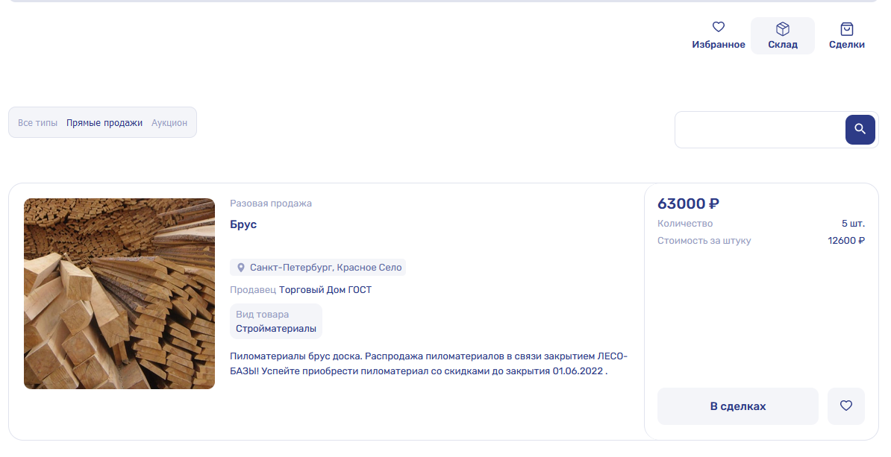

#Pet-Project [vue-test-construct](https://vue-test-construct.vercel.app/#/)

SPA on Vue3 which contains three pages: "Storage", "Favorites" and "Deals". 

On "Storage" page following actions are performed:
* Sort offers by type (all, auction, direct sales);
* Search by name;
* Add offer to business deals;
* Add offers to favorites.

On "Deals" page following actions are performed:
* Sort offers by type (all, auction, direct sales);
* Pay for business deal;
* Add offer to favorites.

On "Favorites" page following actions are performed:
* Sort offers by type (all, auction, direct sales);
* Pay for business deal;
* Add offer to deals.

### Stack:
* **Vue3**. Composition API
* TypeScript
* Pinia 
* Vue Router
* Axios

---

### To run this project locally:

#### 1. Clone branch master with the `git@github.com:NaviSparrow/vue-test-construct.git`

#### 2. Install dependencies from package.json `npm install`

#### 3. Run the main script `npm run serve`

